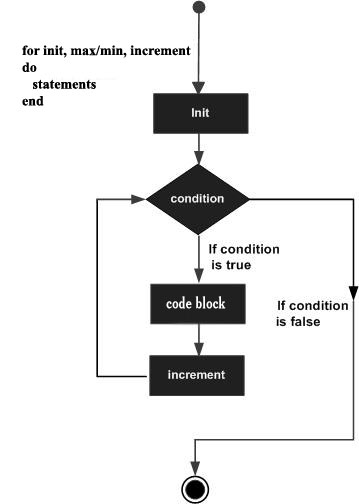

#Lua 中的 for 循环  

for 循环控制结构可以让你高效地写出需要执行特定次数的循环代码。  

##语法  

Lua 语言中 for 循环的语法如下：  

```
for init,max/min value, increment
do
   statement(s)
end
```  

下面是 for 循环执行的流程：  
<ol>
	<li>init 首先执行并且只执行一次。在这一步骤中，你需要声明并初始化循环控制变量。
	</li>
	<li>接下来，max/min 是循环结束的条件。程序中将 init 与 最大值或最小值进行比较，条件为真则继续执行循环，否则结束循环。
	</li>
	<li>循环体执行后，程序跳转至递增或递减语句( increment/descrement )。此语句中，我们可以更新我们的控制变量。
	</li>
	<li>再次检查条件。如果条件为真，则执行循环并重复过程（执行循环体，递增运算，再检查条件）。当条件为假时，结束循环。
	</li>
</ol>

##流程图  
  

##示例  

```
for i=10,1,-1 
do 
   print(i) 
end
```  

执行上面的代码后，将得到如下的输出结果：  

```
10
9
8
7
6
5
4
3
2
1
```
