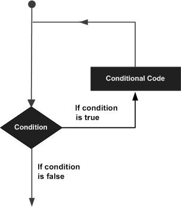

# 循环  
　
虽然一般情况下，语句都是顺序执行的：函数内的第一条语句先执行，然后是第二条，依次类推。  但是还是可能存在需要执行一段代码多次的情况。

为此编程语言提供各式各样的控制结构实现复杂的程序执行路径。
  
其中，循环语句可以让我们可以执行一条或一组语句多次。下图中所描述的是大多数语言中循环语句的形式：  

  

Lua 语言提供了如下几种循环结构语句。点击链接可查看详细说明。  
<table>
	<tr>
		<th>循环类型</th>
		<th>描述</th>
	</tr>
	<tr>
		<td><a href="while.md">while 循环</a></td>
		<td>先检测条件，条件为真时再执行循环体，直到条件为假时结束。</td>
	</tr>
	<tr>
		<td><a href="for.md">for 循环</a></td>
		<td>执行一个语句序列多次，可以简化管理循环变量的代码。</td>
	</tr>
		<tr>
		<td><a href="repeat-until.md">repeat...until 循环</a></td>
		<td>重复执行一组代码语句，直到 until 条件为真为止。</td>
	</tr>
	<tr>
		<td><a href="nested-loop.md">嵌套循环</a></td>
		<td>可以在一个循环语句中再使用一个循环语句。</td>
	</tr>	
</table>  

## 循环控制语句  

循环控制语句改变循环正常的执行顺序。当离开一个作用域时，在该作用域内自动创建的对象都会被自动销毁。
  
Lua 支持如下所示的循环控制语句。点击下面的链接查看详细内容：  
<table>
	<tr>
		<th>循环控制语句</th>
		<th>描述</th>
	</tr>
		<tr>
		<td><a href="break.md">break</a></td>
		<td>break 语句结束循环，并立即跳转至循环或 switch 语句后的第一条语句处开始执行。</td>
	</tr>	
</table>

## 无限循环  

如果循环条件永远不可能为假，则此循环为无限循环。while 语句经常被当作无限循环语句使用。因为我们可以直接将其条件设置为真，这样 while 就会一直循环下去。在无限循环中，可以使用 break 跳出循环。  

```
while( true )
do
   print("This loop will run forever.")
end
```

