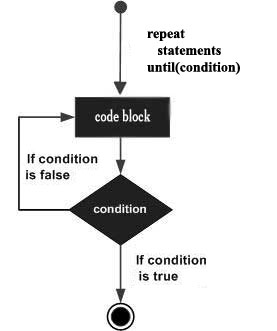

#repeat...until 循环  

与 for 和 while 循环中先检测条件再决定是否执行循环不同，repeat...until 先执行循环再检测条件判断是否再次执行。  
除了 repeat...until 循环一定会执行一次之外，repeat...until 与 while 循环很相似。  

##语法  

Lua 语言中 repeat...until 循环的语法如下：  

```
repeat
   statement(s)
until( condition )
```  

请注意，条件表达式出现在循环的结束处，所以在检查条件之前，循环体中语句 statement(s) 已经执行了一次。  
如果条件为假，则控制回到循环开始再次执行循环体。这个过程一直重复到条件为真时结束。

##流程图  


##示例  
```
--[ 局部变量定义 --]
local a = 10
--[ 重复循环执行 --]
repeat
   print("value of a:", a)
   a = a + 1
until( a > 15 )
```
执行上面的代码，将会得到如下的结果：  

```
value of a:	10
value of a:	11
value of a:	12
value of a:	13
value of a:	14
value of a:	15
```
