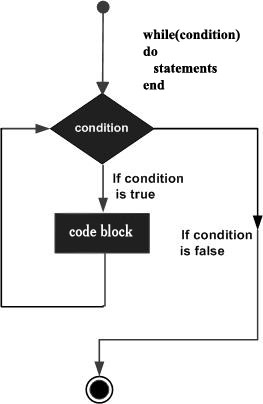

#Lua while 循环  

在 Lua 语言中，只要 while 循环条件为真，while 语句就会一直执行，直到 while 循环条件为假为止。  

#语法  

Lua 语言中 while 循环的语法如下所示：  

```
while(condition)
do
   statement(s)
end
```  

其中，statement(s) 可能只是一条语句也可能是一个语句块。条件可以是任何表达式，若表达式结果为真，则循环继续。  
循环为假时，程序结束 while 循环，执行 while 后面的代码。  

##流程图  

  

请注意，while 循环的关键点在于循环可能根本不会执行。当检测条件为假是，程序会跳过 while 循环体而直接执行 while 后的第一条语句。  

##示例  

```
a=10
while( a < 20 )
do
   print("value of a:", a)
   a = a+1
end
```  

执行上面的代码，将会得到如下的结果：  

```
value of a:	10
value of a:	11
value of a:	12
value of a:	13
value of a:	14
value of a:	15
value of a:	16
value of a:	17
value of a:	18
value of a:	19
```


